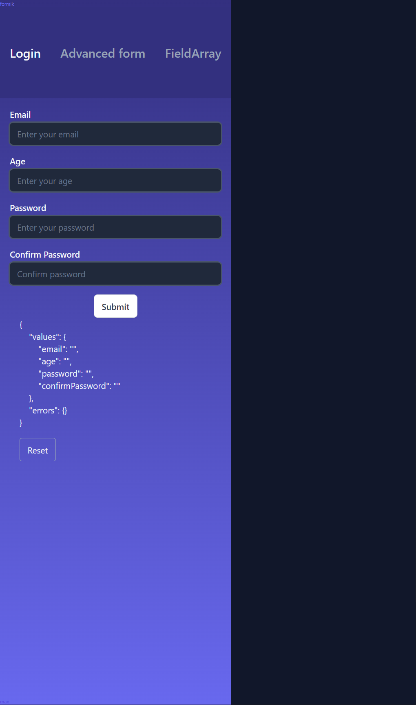

### About

Playground for React forms with Formik

### Links, refs, credits

* [Formik alternatives](https://www.youtube.com/shorts/-CK8qZMsHuw)
    * [react-form](https://github.com/TanStack/form) 66% smaller
    * [react-final-form](https://www.npmjs.com/package/react-final-form) 75% smaller + similar to Formik

* [Formik docs](https://formik.org/docs/overview) ([repo](https://github.com/jaredpalmer/formik), [source in web vscode](https://github.dev/jaredpalmer/formik/blob/master/packages/formik/src/Formik.tsx))
* [Formik with Yup](https://youtu.be/7Ophfq0lEAY?t=377) ([repo](https://github.com/nikitapryymak/formik-tutorial/tree/finished-files)).
* [FieldArray](https://youtu.be/me1kY_uFe5k?t=1902) ([repo](https://github.com/bmvantunes/youtube-2021-jan-field-array-formik/blob/main/src/pages/index.tsx), [demo](https://youtube-2021-jan-field-array-formik.vercel.app/)).
* [formik-mui](https://stackworx.github.io/formik-mui)
